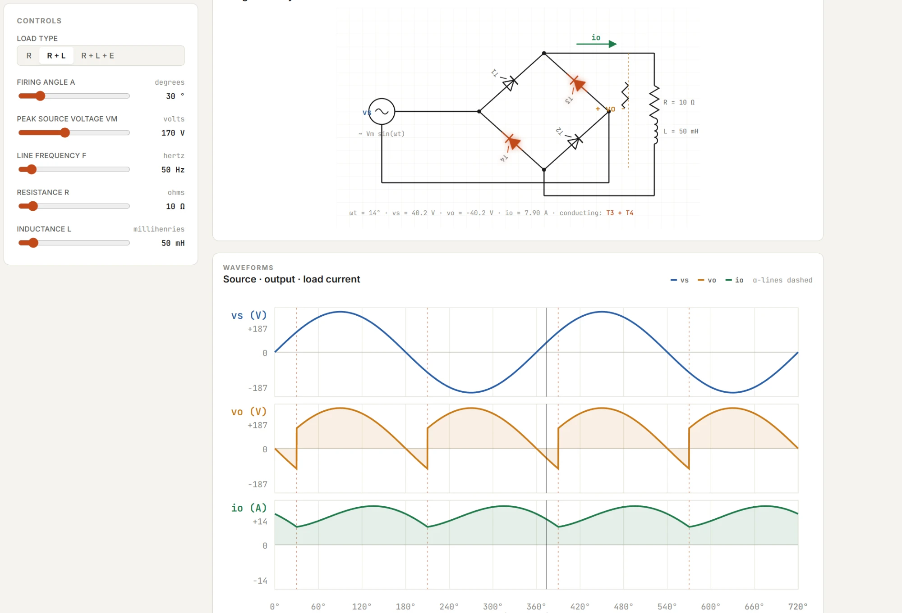

# Full Wave Rectifier Simulator

An interactive full-wave bridge rectifier simulation with circuit visualization, waveform plotting, and real-time parameter adjustment.

## Features

- **Load Type Selection** — R, R+L, and R+L+E load configurations
- **Adjustable Parameters:**
  - Firing angle (alpha)
  - Peak source voltage (Vm)
  - Line frequency (f)
  - Resistance (R)
  - Inductance (L)
- **Circuit Visualization** — Interactive circuit diagram showing conducting thyristors (T1-T4) with real-time highlighting
- **Waveform Display:**
  - Source voltage vs (V)
  - Output voltage vo (V)
  - Load current io (A)
  - Alpha reference lines (dashed)
- **Real-Time Calculations** — Instantaneous values of wt, vs, vo, io, and conducting thyristor pairs
- **Two Full Cycles** — Displays waveforms over 720 degrees for complete analysis

## How to Use

1. Open `Full Wave Rectifier Simulator.html` in a web browser
2. Select the load type (R, R+L, or R+L+E)
3. Adjust firing angle and circuit parameters using the sliders
4. Observe the circuit diagram and waveforms update in real-time

## Tech Stack

- HTML / CSS / JavaScript
- JSX (React-based components)
- Custom simulation engine
- Canvas-based circuit and waveform rendering
